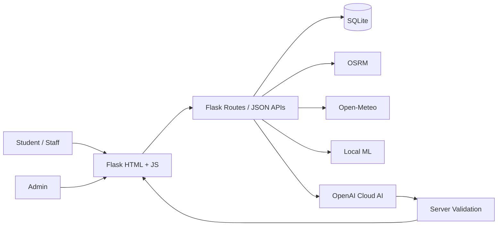

# GreenRoute Campus

**Smart campus mobility prototype · BBDNITM, Lucknow**  
**Tagline:** Don't just build a model, build a solution.

[](https://github.com/OWNER/REPOSITORY/actions/workflows/ci.yml)

GreenRoute Campus is a Flask-based sustainable campus transportation application that combines route planning, transport comparison, cloud AI assistance, personal impact tracking, and campus mobility analytics.

> **Project status:** Educational/demo project. Transport factors and emissions are approximations and should not be treated as official carbon-accounting data.

## Highlights

- Real cloud AI through the OpenAI Responses API, with a local fallback.
- Server-side transport calculations shared by the planner, AI, and trip logging.
- Leaflet/OpenStreetMap map with OSRM route geometry and Haversine fallback.
- Walk, bicycle, e-rickshaw, city bus, metro, motorbike, auto, car, and carpool comparison.
- Weather/AQI context through Open-Meteo with safe fallback behavior.
- Trip logging, Green Points, levels, badges, streaks, challenges, and leaderboard.
- Carpool posting/request flow and history-based local ML recommendations.
- Admin dashboard with CSV export and printable PDF summary.
- Responsive UI, dark mode, and installable PWA shell.
- SDG 11 project explanation, presentation PDF, and QR code included in the app.

## Screens and project materials

The repository includes:

- `static/GreenRoute_Campus_Presentation.pdf` — project presentation.
- `static/presentation_qr.png` — QR code pointing to the local presentation URL used by the demo.
- `static/sdg11_un_icon.png` — SDG 11 visual reproduction following the UN SDG visual specification; it is **not** presented as a UN endorsement.
- `DEMO_SCRIPT.md` — suggested live demonstration flow.
- `START_HERE.txt` — quick setup notes.

## Architecture



## Requirements

- Python 3.11 or newer is recommended.
- Windows, Linux, or macOS.
- Internet access is needed for optional external routing/weather services and cloud AI.
- A valid OpenAI API key is needed only if you want cloud AI enabled.

## Quick start — Linux / macOS

The project includes a native shell workflow.

```bash
chmod +x install_linux.sh run.sh
./install_linux.sh
./run.sh
```

Then open:

`http://localhost:5000`

You can also use:

```bash
make install
make run
make test
```

If your Linux distribution does not provide Python's virtual-environment module by default, install the appropriate `python3-venv` package first.

## Quick start — Windows

Double-click `run.bat`.

It creates the virtual environment, installs dependencies, creates `.env` from `.env.example`, seeds demo data on the first launch, and starts Flask.

Open:

`http://localhost:5000`

To intentionally rebuild the demo database, run `reset_demo.bat`.

## Demo accounts

These accounts are created by the local demo seed script:

- **Admin:** `admin@greenroute.local` / `demo123`
- **Student:** `student@greenroute.local` / `demo123`

These are demo credentials only. If the application is deployed publicly, change/remove them and use real authentication controls.

## Enable cloud AI

1. Start the project once so the local environment exists.
2. Run `setup_ai.bat` on Windows, or create `.env` manually on Linux/macOS.
3. Set:

```env
OPENAI_API_KEY=your_key_here
OPENAI_MODEL=gpt-5.6-luna
```

4. Restart the application.
5. Open **AI Copilot** and check its status badge.

Never commit `.env` or paste an API key into source code, screenshots, GitHub issues, or chat. `.env` is ignored by Git.

## External services

| Service | Purpose | If unavailable |
|---|---|---|
| OpenAI Responses API | Cloud AI Copilot | Local AI/scoring fallback |
| OSRM | Route geometry | Haversine point-to-point fallback |
| Open-Meteo | Weather/AQI context | Safe fallback values |
| OpenStreetMap/Leaflet | Map display | Core non-map features remain usable |

Service availability and rate limits are controlled by the respective providers.

## Data and calculation notes

Routing uses OSRM with a Haversine fallback. Weather/AQI uses Open-Meteo with a default fallback. Transport cost, speed, emissions, and activity factors are defined centrally so they can be inspected or replaced without rewriting the UI.

The transport factors are educational approximations, not official carbon-accounting values. The app's **Assumptions** page explains the model and its limitations.

## SDG alignment

The project is designed around **UN Sustainable Development Goal 11 — Sustainable Cities and Communities**, particularly **Target 11.2**, which concerns access to safe, affordable, accessible, and sustainable transport systems.

The repository uses an SDG 11 visual reproduction based on the published UN visual specification. The project does not use the UN emblem and does not claim UN endorsement. See the presentation PDF and the source/attribution section in the app for context.

## Testing

Run:

```bash
pytest -q
```

A syntax-only check can be run with:

```bash
python -m py_compile app/__init__.py app/config.py app/db.py app/services/*.py app/ml/*.py seed.py setup_ai.py
```

The GitHub Actions workflow runs dependency installation, Python compilation, and the test suite on pushes and pull requests.

## Repository structure

```text
GreenRoute_Campus_PRO/
├── app/                  # Flask application, services, ML, database logic
├── templates/            # Jinja HTML templates
├── static/               # CSS, JS, PWA assets, SDG card, PDF and QR
├── tests/                # Automated tests
├── .github/              # CI, issue templates and PR template
├── .env.example          # Safe configuration template
├── install_linux.sh      # Linux/macOS setup helper
├── run.sh                # Linux/macOS launcher
├── run.bat               # Windows launcher
├── setup_ai.py           # Secure local AI-key setup
├── seed.py               # Demo database seed
├── Makefile              # Common Linux/macOS commands
├── requirements.txt      # Python dependencies
├── CONTRIBUTING.md       # Contribution workflow
├── SECURITY.md           # Security reporting guidance
├── LICENSE               # MIT license
└── README.md             # Project documentation
```

## GitHub publishing checklist

Before pushing this project to GitHub:

- [x] `.env` is ignored.
- [x] SQLite database files are ignored.
- [x] Virtual environments and Python caches are ignored.
- [x] Linux and Windows launchers are included.
- [x] README and setup instructions are included.
- [x] License is included.
- [x] Contribution and security guidance are included.
- [x] GitHub Actions CI is included.
- [x] Issue and pull-request templates are included.
- [ ] Replace `OWNER/REPOSITORY` in the README badge after creating your GitHub repository.
- [ ] Review the repository's GitHub **About** description, topics, and visibility before publishing.
- [ ] Confirm that no personal files, real credentials, API keys, private exports, or production databases are present.

## First Git commands

From the project folder:

```bash
git init
git add .
git status
git commit -m "Initial GreenRoute Campus release"
git branch -M main
git remote add origin https://github.com/YOUR-USERNAME/YOUR-REPOSITORY.git
git push -u origin main
```

After creating the GitHub repository, replace the placeholder remote with your real repository URL.

## Future scope

Verified campus shuttle feeds, campus SSO, privacy-preserving aggregate heatmaps, route-aware carpool matching, calibrated Indian city-specific emission factors, and institutional deployment.
